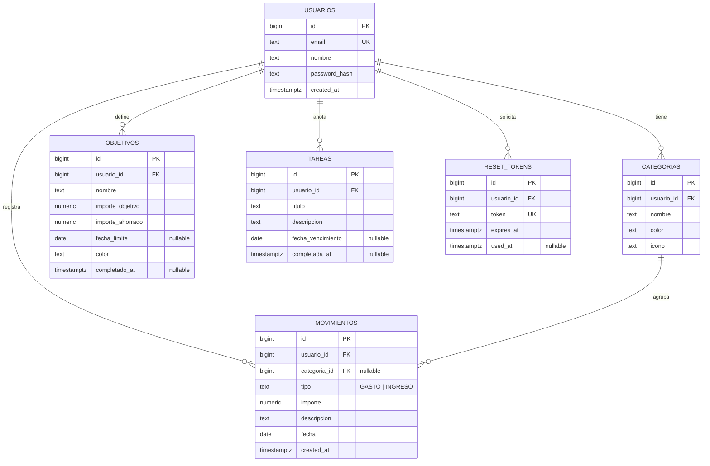
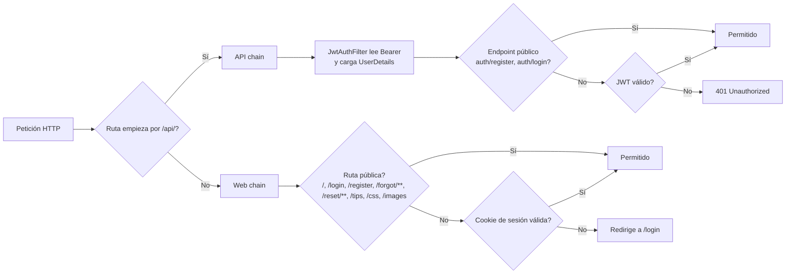
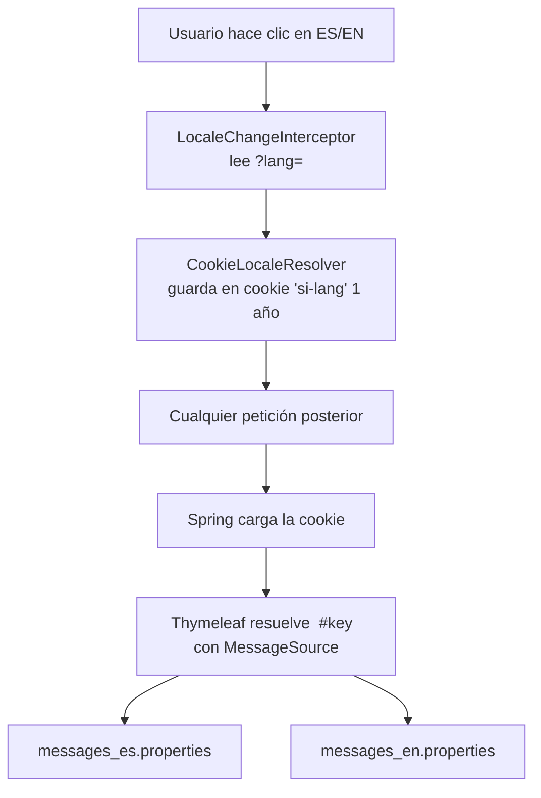
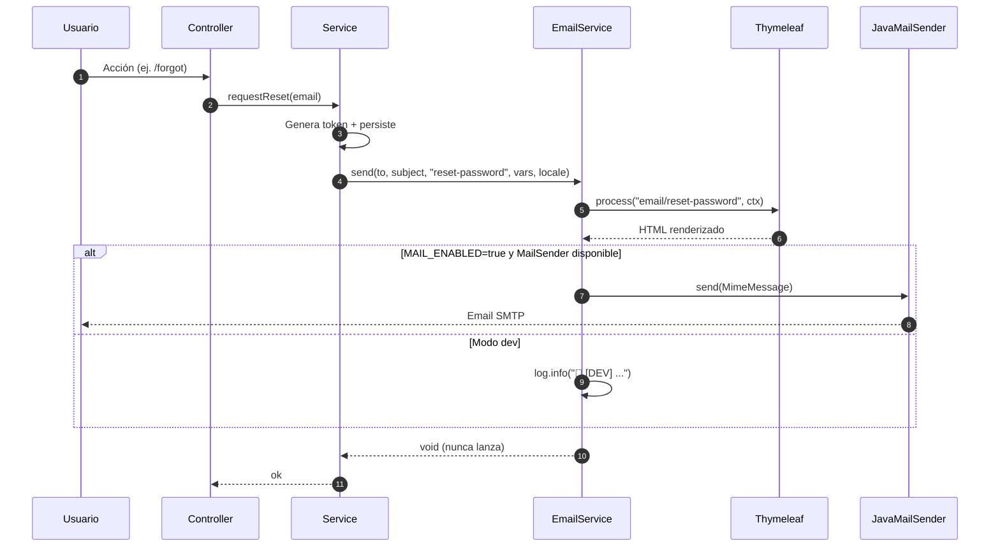
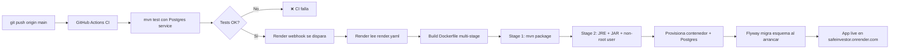

# SafeInvestor — Memoria técnica

> Documento de arquitectura del proyecto final de 2ºDAM. Acompaña al [README](README.md), que cubre el qué se entrega; este documento cubre el cómo y por qué.

---

## 1. Visión general

SafeInvestor es una **aplicación web de finanzas personales** que permite:

- Registrar y consultar movimientos (gastos/ingresos) categorizados.
- Marcar metas de ahorro con barra de progreso y aportaciones acumuladas.
- Llevar tareas financieras con vencimiento (recordatorios diarios por email).
- Visualizar el dashboard con KPIs y gráficos (Chart.js).
- Exportar a CSV o generar un informe imprimible.
- Importar movimientos masivamente desde un CSV bancario, con auto-categorización.
- Aprender de 30 tips de economía clasificados por temática.

La app está desplegada públicamente en [safeinvestor.onrender.com](https://safeinvestor.onrender.com) (plan free de Render — la primera petición tras 15 min de inactividad tarda ~30 s en despertar).

Es la evolución de [v1, una aplicación de escritorio JavaFX con SQLite](https://github.com/franciscorodalf/SafeInvestor/tree/v1-javafx) hecha en 1ºDAM, convertida ahora en aplicación web multiusuario con persistencia en PostgreSQL.

---

## 2. Stack y razones de elección

| Capa | Tecnología | Por qué |
|---|---|---|
| Lenguaje | **Java 21** (LTS) | Estabilidad a largo plazo, soporte del IDE y mercado laboral. |
| Framework backend | **Spring Boot 3.3** | Estándar de facto en Java empresarial. Autoconfiguración, ecosistema enorme. |
| ORM | **Spring Data JPA + Hibernate 6** | Repositorios declarativos; specifications para queries dinámicas. |
| BBDD | **PostgreSQL 16** | RDBMS robusto con soporte real de tipos. Se evita SQLite porque no escala multiusuario. |
| Migraciones | **Flyway** | Versionado del esquema, repetible en cualquier entorno. |
| Seguridad | **Spring Security 6** + **JWT (jjwt 0.12)** + **BCrypt** | Doble filter chain: sesión cookie para web, stateless JWT para API. |
| Plantillas | **Thymeleaf 3** | Server-side rendering, sin necesidad de SPA. Internacionalización integrada con MessageSource. |
| CSS | **Tailwind CSS** vía CDN | Diseño rápido con utilidades; sin pipeline de build. |
| Gráficos | **Chart.js 4** vía CDN | Donut + line charts vanilla JS. |
| Tipografía | **Instrument Serif** + **Sora** + **JetBrains Mono** vía Google Fonts | Pareja serif/sans con buena legibilidad. |
| Iconos | **Phosphor Icons** vía jsdelivr | Familia completa, peso ligero, dos estilos por icono. |
| Tests | **JUnit 5** + **MockMvc** + **Mockito** | Integración real contra Postgres en CI. |
| Build | **Maven** + **wrapper** | Sin necesidad de instalar Maven en local ni en CI. |
| CI | **GitHub Actions** | Postgres como service container, run de tests en cada push. |
| Despliegue | **Render** (plan free) | Auto-deploy en push a main vía blueprint (`render.yaml`). |
| Email | **Spring Mail** (JavaMailSender) | Cliente SMTP. Fallback a log si no hay host configurado. |

### Decisiones que se discutieron

- **Por qué Java y no Node/Python**: el grado es de DAM, Java es lo que enseñan; quiero un proyecto que un examinador del propio módulo pueda leer sin sorpresas. Spring Boot además es lo que más demandan las empresas españolas en backend.
- **Por qué Thymeleaf y no React**: el alcance del proyecto cabe en server-rendered sin perder UX. Evita complejidad de build (Vite/webpack) y problemas de hidratación. El selector de idioma y el dark mode funcionan sin JS framework.
- **Por qué doble filter chain de Spring Security**: la web (forms + cookie de sesión) y la API REST (Bearer JWT) tienen necesidades incompatibles. Separarlas en dos chains distintos es más limpio que intentar que ambas convivan en uno.
- **Por qué Render y no Railway/Fly.io**: Render tiene plan free con Postgres incluido y auto-deploy desde GitHub. Railway empezó a cobrar y Fly.io requiere CLI para todo.
- **Por qué CDN para Tailwind/Chart.js**: para un proyecto pedagógico, el coste de mantener un pipeline de assets (Vite, Tailwind CLI) no justifica los ms ahorrados. CDN versionado evita problemas de breaking changes.

---

## 3. Arquitectura por capas

```
┌──────────────────────────────────────────────────────────────────┐
│  Navegador del usuario                                            │
│  └─ Thymeleaf HTML + Tailwind + Chart.js + ES/EN + dark mode      │
└────────────────┬────────────────────────────┬─────────────────────┘
                 │ HTTP (cookie sesión)       │ HTTP (Bearer JWT)
                 ▼                            ▼
┌──────────────────────────────┐  ┌──────────────────────────────┐
│  WEB FILTER CHAIN (orden 2)   │  │  API FILTER CHAIN (orden 1)  │
│  - CSRF disabled              │  │  - Stateless                 │
│  - Form login                 │  │  - JwtAuthenticationFilter   │
│  - Session cookie             │  │  - /api/auth/* permit-all    │
└──────────────┬────────────────┘  └──────────────┬───────────────┘
               │                                  │
               ▼                                  ▼
┌──────────────────────────────────────────────────────────────────┐
│  CONTROLLERS                                                      │
│  ┌──────────────┐ ┌──────────────┐ ┌──────────────┐               │
│  │ web/         │ │ api/         │ │ rest export  │               │
│  │ (Thymeleaf)  │ │ (REST JSON)  │ │ (CSV / PDF)  │               │
│  └──────┬───────┘ └──────┬───────┘ └──────┬───────┘               │
│         │                │                │                       │
└─────────┼────────────────┼────────────────┼───────────────────────┘
          │                │                │
          └────────────────┴────────────────┘
                           │
                           ▼
┌──────────────────────────────────────────────────────────────────┐
│  SERVICES                                                         │
│  UsuarioService · CategoriaService · MovimientoService            │
│  ObjetivoService · TareaService · CsvImportService                │
│  EstadisticasService · EmailService · PasswordResetService        │
│  TareasReminderJob (@Scheduled)                                   │
└──────────────────────────┬───────────────────────────────────────┘
                           │
                           ▼
┌──────────────────────────────────────────────────────────────────┐
│  REPOSITORIES (Spring Data JPA)                                   │
│  + JpaSpecificationExecutor para queries dinámicas                │
└──────────────────────────┬───────────────────────────────────────┘
                           │
                           ▼
┌──────────────────────────────────────────────────────────────────┐
│  PostgreSQL 16  (esquema gestionado por Flyway)                   │
└──────────────────────────────────────────────────────────────────┘
```

### Organización por feature, no por capa

El paquete raíz `es.franciscorodalf.safeinvestor` se subdivide **por dominio**, no por capa:

```
auth/        ← Usuario, JWT, registro, login, reset
movimientos/ ← Movimientos, categorías, import CSV, export CSV/PDF
objetivos/   ← Metas de ahorro
tareas/      ← Recordatorios financieros + job de email diario
estadisticas/← Agregados para dashboard (gastos por categoría, evolución)
tips/        ← 30 tips de economía + filtrado por categoría
email/       ← EmailService genérico
config/      ← SecurityConfig, I18nConfig
```

Dentro de cada feature, sí se divide por capa: `domain/`, `service/`, `web/`, `api/`. Esto facilita borrar o reescribir una feature completa sin tocar las demás.

---

## 4. Modelo de datos (ER)



### Cumplimiento de las migraciones

Las migraciones Flyway están en `src/main/resources/db/migration/`:

| Versión | Qué crea |
|---|---|
| `V1__init.sql` | Esquema vacío (placeholder para que arranque Flyway). |
| `V2__usuarios_y_reset_tokens.sql` | Tablas `usuarios` y `password_reset_tokens`. |
| `V3__categorias_y_movimientos.sql` | Tablas `categorias` y `movimientos` con FKs. |
| `V4__objetivos_y_tareas.sql` | Tablas `objetivos` y `tareas` con FKs. |

Cada usuario nuevo recibe 11 **categorías default** (Comida, Transporte, Hogar, Ocio, Salud, Compras, Servicios, Otros gastos, Nómina, Freelance, Otros ingresos), sembradas en el hook `UsuarioService.register()`.

---

## 5. Seguridad

### Doble cadena de filtros



### Almacenamiento de contraseñas

- **BCrypt** con factor 10 (default de Spring Security). Cada hash incluye su propio salt.
- Nunca se loguea el password en plano.
- En el endpoint de reset, los tokens son 32 bytes aleatorios (`SecureRandom`) codificados en Base64 URL-safe y caducan a la hora.

### CSRF

CSRF está **desactivado en la web chain**. Se documenta porque es una decisión consciente — Spring Security 6 lo activa por defecto y rompía el render de Thymeleaf en formularios complejos. Como toda la API REST va por JWT (no por cookie), el ataque CSRF clásico (que se aprovecha de la cookie automática del navegador) no aplica a `/api/**`.

Para producción seria se reactivaría con tokens Synchronizer.

---

## 6. Internacionalización



- **Default**: español. Cookie con caducidad de 1 año.
- ~280 claves en cada `properties`. Cobertura: nav, auth, dashboard, movimientos, categorías, objetivos, tareas, tips, imports, emails, comunes.
- **Plural**: claves `_one` / `_many` resueltas con ternario en el template.
- **Fechas**: cada idioma tiene su propio patrón en `dashboard.date_format` y `dashboard.month_short_format` — se inyecta vía `#temporals.format(fecha, #messages.msg('dashboard.date_format'))`.
- **JS**: las labels de Chart.js se inyectan desde Thymeleaf vía `<script th:inline="javascript">` con un objeto `window.__i18n`.
- **Emails**: el `EmailService` acepta un `Locale` explícito (se respeta el del request, o ES por defecto en el job @Scheduled).

---

## 7. Subsistema de email



- **EmailService es a prueba de fallos**: si la plantilla no existe, si el SMTP cae, o si el destinatario es null, se traga la excepción y la loguea. **Nunca** propaga al caller. Esto evita que un fallo de email rompa una transacción.
- **3 plantillas activas**: `reset-password`, `objetivo-completado`, `tareas-vencidas`. Todas heredan de `_layout.html` (shell común con header, footer y estilos inline para compatibilidad con clientes de email).
- **Job @Scheduled**: `TareasReminderJob` corre cada día a las 9:00 (cron configurable). Agrupa las tareas vencidas por usuario y envía **un email por persona**, no uno por tarea.

### Activar SMTP real

Solo hay que añadir env vars al servicio en Render (no toca código):

```
MAIL_ENABLED=true
MAIL_HOST=smtp.gmail.com
MAIL_PORT=587
MAIL_USERNAME=tu-cuenta@gmail.com
MAIL_PASSWORD=<App password de Gmail>
MAIL_FROM=SafeInvestor <tu-cuenta@gmail.com>
```

---

## 8. Importación de CSV bancario

El parser está en `CsvImportService` y es agnóstico al banco — auto-detecta el formato:

```mermaid
flowchart LR
    A[Bytes CSV] --> B[Detect charset<br/>UTF-8 BOM / ISO-8859-1]
    B --> C[Detect separador<br/>; , tab |]
    C --> D[Para cada línea]
    D --> E[Split respetando comillas]
    E --> F[Para cada celda:<br/>tryDate? tryNumber? texto?]
    F --> G[Construye Row<br/>fecha + tipo + importe + descripción]
    G --> H[sugerirCategoria<br/>keyword match]
    H --> I[Cache en HttpSession]
    I --> J[Render preview editable]
    J --> K[Confirm → MovimientoService.create * N]
```

### Heurísticas implementadas

1. **Charset**: BOM UTF-8 → UTF-8. Si decoded UTF-8 contiene `�` (replacement char) → ISO-8859-1.
2. **Separador**: cuenta ocurrencias de `,`, `;`, `\t`, `|` en las primeras 8 líneas, gana el más frecuente.
3. **Decimal**: si la cifra tiene coma Y punto, gana el último (`-1.234,56` → europeo; `-1,234.56` → US). Si solo coma → europeo. Si solo punto → US.
4. **Fecha**: 5 formatos (`dd/MM/yyyy`, `dd-MM-yyyy`, `yyyy-MM-dd`, `dd.MM.yyyy`, `yyyy/MM/dd`). Se prueba cada uno.
5. **Tipo**: signo del importe (negativo = GASTO, positivo = INGRESO).
6. **Anti-falso-positivo**: enteros sin decimales en rango [1900, 2100] se descartan como importe (probablemente son años).
7. **Cabecera**: no se trata como caso especial — simplemente, si una línea no tiene ni fecha ni número, no parsea y suma a `skippedLines`.
8. **Categorización**: mapa estático de ~50 keywords agrupadas por categoría canónica. Para cada fila, si la descripción contiene una keyword, se busca una categoría del usuario cuyo nombre case (tolerando mayúsculas y acentos).

### Cubierto por tests

`CsvImportServiceTest` valida 12 escenarios (formato ES, formato US, comillas, año-falso, encoding ISO, BOM, truncado de descripción, etc).

---

## 9. Despliegue



- **Dockerfile multi-stage**: imagen final ~200 MB (Alpine JRE + app JAR + user no-root). El build en Render tarda ~3 min.
- **render.yaml**: blueprint declarativo. Define el web service, la BBDD Postgres free, y las env vars (`JWT_SECRET`, `APP_BASE_URL`, etc).
- **Migraciones automáticas**: Flyway se ejecuta al arrancar el contenedor con `baseline-on-migrate=true` para que el primer deploy a una BBDD recién creada funcione.
- **Free tier**: el servicio se duerme tras 15 min sin tráfico. El primer hit tarda ~30 s en despertar. A partir de ahí va fluido.

---

## 10. Calidad y tests

| Capa | Tests | Cobertura |
|---|---|---|
| Smoke test | `SafeInvestorApplicationTests` | El context arranca. |
| Servicios | `UsuarioServiceTest`, `CategoriaServiceTest`, `MovimientoServiceTest`, `ObjetivoServiceTest`, `TareaServiceTest`, `JwtServiceTest` | Lógica de negocio core. |
| API REST | `AuthApiControllerTest`, `MovimientoApiControllerTest`, `ObjetivoApiControllerTest` | Flujos completos con MockMvc + JWT. |
| Email (F7) | `EmailServiceTest` | Modo dev (sin SMTP). |
| Import CSV (F8) | `CsvImportServiceTest` | 12 escenarios: encoding, separador, decimal, fecha, año-falso, sugerencia categoría. |

**Total: ~36 tests**. Todos corren en GitHub Actions contra un Postgres real en service container. Las transacciones se hacen rollback (anotación `@Transactional` en cada test) para aislar el estado entre tests.

---

## 11. Endpoints (vista rápida)

Ver [README.md § Endpoints](README.md#endpoints) para el listado completo. Resumen:

- **28 endpoints web** (Thymeleaf + sesión): auth, movimientos, categorías, objetivos, tareas, tips, import, export, informe, estadísticas.
- **22 endpoints REST** (JWT): equivalente JSON para movimientos, categorías, objetivos, tareas + auth.
- **1 endpoint Actuator**: `/actuator/health`.

Cualquier ruta acepta `?lang=es|en` para cambiar idioma (persiste en cookie).

---

## 12. Limitaciones conocidas

- **Multi-moneda**: la app asume euro. No hay conversión ni soporte para otras divisas.
- **Grupos compartidos**: cada usuario solo ve sus datos. Compartir gastos con otra persona (estilo SplitExpenser) está fuera de scope.
- **Recurrencias**: no hay movimientos automáticos (alquiler mensual, etc). Se han de crear manualmente o vía import CSV.
- **2FA**: solo BCrypt + JWT. No hay segundo factor.
- **Render free**: la app se duerme tras 15 min. Para producción real haría falta plan starter ($7/mes).

---

## 13. Resumen de roadmap

- [x] **Fase 0–1**: scaffold + auth + reset + deploy en Render
- [x] **Fase 2**: movimientos + categorías
- [x] **Fase 3**: objetivos + tareas
- [x] **Fase 4**: dashboard + Chart.js + export CSV + informe imprimible
- [x] **Fase 5**: tips + i18n ES/EN + dark mode
- [x] **Fase 7**: emails (reset real + objetivo cumplido + recordatorios @Scheduled)
- [x] **Fase 8**: importar CSV bancario con auto-detección
- [ ] _Posibles extensiones_: presupuestos por categoría, movimientos recurrentes, PWA instalable, OpenAPI/Swagger UI, pantalla de perfil, búsqueda full-text, 2FA, grupos compartidos.
